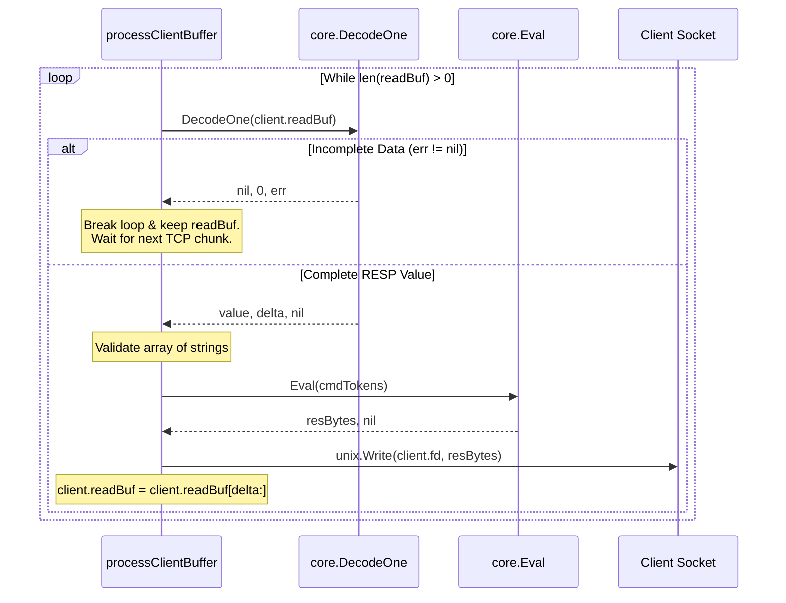

# Architecture & Execution Flow

This document details the complete end-to-end execution flow of the Redis server implementation at its current state.

---

## 1. High-Level System Architecture

```mermaid
flowchart TD
    subgraph Initialization ["1. Initialization (main.go)"]
        A[main] -->|parse flags: --host, --port| B[StartServer host, port]
    end

    subgraph ServerSetup ["2. Server Bootstrap (server.go)"]
        B --> C[parseIPv4 host]
        C -->|addr [4]byte| D["unix.Socket(AF_INET, SOCK_STREAM|SOCK_NONBLOCK, 0)"]
        D -->|serverFd| E["unix.Bind(serverFd, SockaddrInet4)"]
        E --> F["unix.Listen(serverFd, 128)"]
        F --> G["unix.EpollCreate1(0) -> epollFd"]
        G --> H["unix.EpollCtl(ADD serverFd, EPOLLIN)"]
    end

    subgraph EventLoop ["3. Event Loop (server.go)"]
        H --> I["unix.EpollWait(epollFd, events, -1)"]
        I -->|n ready events| J{Is fd == serverFd?}
        J -- YES --> K[acceptNewConnection]
        J -- NO --> L[handleClientData]
        K --> I
        L --> I
    end

    subgraph ConnectionHandling ["4. Client Data & Stream Processing"]
        L -->|unix.Read loop until EAGAIN| M["Append to client.readBuf"]
        M --> N[processClientBuffer]
        N --> O["core.DecodeOne(client.readBuf)"]
        O -->|incomplete / err != nil| P[Stop & Wait for more TCP data]
        O -->|complete / delta bytes| Q["Convert tokens to []string"]
        Q --> R["core.Eval(cmdTokens)"]
        R --> S["unix.Write(client.fd, resBytes)"]
        S --> T["client.readBuf = client.readBuf[delta:]"]
        T -->|More bytes in readBuf?| O
    end
```

---

## 2. Phase-by-Phase Walkthrough

### Phase 1: Entry Point & CLI Parsing (`main.go`)

```
func main()
```
1. **Flag Parsing**:
   - `flag.IntVar(&port, "port", 7879, "Port to listen on")`
   - `flag.StringVar(&host, "host", "0.0.0.0", "Host address to bind to")`
   - `flag.Parse()`
2. **Handoff**:
   - Calls `StartServer(host, port)` in [server.go](file:///home/jayanthgowda/my-own-redis/MY-OWN-REDIS/server.go#L38).
   - `main.go` remains purely an entry point with no low-level socket or epoll logic.

---

### Phase 2: Socket Bootstrap & Epoll Registration (`server.go`)

```
func StartServer(host string, port int)
```

1. **Host Resolution (`parseIPv4`)**:
   - **Signature**: `func parseIPv4(host string) ([4]byte, error)`
   - **Inputs**: `host` (e.g., `"127.0.0.1"`, `"0.0.0.0"`, `"localhost"`)
   - **Logic**:
     - Attempts `net.ParseIP(host)`.
     - If not an IP literal, resolves via `net.ResolveIPAddr("ip4", host)`.
     - Extracts the 4 IPv4 bytes using `ip.To4()`.
   - **Output**: `addr [4]byte`, `err error`.

2. **Raw Socket Creation**:
   - `unix.Socket(unix.AF_INET, unix.SOCK_STREAM|unix.SOCK_NONBLOCK, 0)`
   - Creates a non-blocking TCP socket file descriptor (`serverFd`).

3. **Socket Binding & Listening**:
   - `sa := &unix.SockaddrInet4{Port: port, Addr: addr}`
   - `unix.Bind(serverFd, sa)` binds the socket to the resolved address and port.
   - `unix.Listen(serverFd, 128)` configures the OS backlog queue to hold up to 128 pending handshakes.

4. **Epoll Instance Creation**:
   - `epollFd, err := unix.EpollCreate1(0)`
   - Creates a Linux kernel epoll interest list.

5. **Register Listening Socket**:
   - Constructs `event := unix.EpollEvent{Events: unix.EPOLLIN, Fd: int32(serverFd)}`.
   - Calls `unix.EpollCtl(epollFd, unix.EPOLL_CTL_ADD, serverFd, &event)`.
   - Epoll will now notify us whenever an incoming TCP connection is ready to be accepted.

---

### Phase 3: The Non-Blocking Event Loop (`server.go`)

The core server loop runs indefinitely:

```go
events := make([]unix.EpollEvent, 128)
for {
    n, err := unix.EpollWait(epollFd, events, -1)
    ...
}
```

1. **Kernel Sleep (`unix.EpollWait`)**:
   - The thread sleeps with zero CPU usage until kernel events fire on registered file descriptors (`-1` timeout).
   - On wakeup, returns `n` (number of triggered events) and populates the `events` slice.
   - If interrupted by a signal (`err == unix.EINTR`), it retries without crashing.

2. **Event Dispatching**:
   - For each event `0 <= i < n`:
     - `fd := events[i].Fd`
     - **If `fd == int32(serverFd)`**: The listening socket received a new connection $\rightarrow$ invokes `acceptNewConnection(serverFd, epollFd)`.
     - **Else**: A connected client socket has incoming data $\rightarrow$ invokes `handleClientData(fd, epollFd)`.

---

### Phase 4: Accepting New Clients (`server.go`)

```
func acceptNewConnection(serverFd int, epollFd int)
```

1. **Accepting Handshake**:
   - Calls `clientFd, _, err := unix.Accept(serverFd)`.
   - If `err == EAGAIN` or `EWOULDBLOCK`, no more connections are queued $\rightarrow$ returns.
2. **Setting Non-Blocking**:
   - `unix.SetNonblock(clientFd, true)` ensures future read and write syscalls never block the single-threaded event loop.
3. **Registering with Epoll**:
   - `clientEvent := unix.EpollEvent{Events: unix.EPOLLIN, Fd: int32(clientFd)}`
   - `unix.EpollCtl(epollFd, unix.EPOLL_CTL_ADD, clientFd, &clientEvent)` enables read event notifications on this client.
4. **Allocating Per-Client State**:
   - Initializes a new `Client` struct in the global map:
     ```go
     clients[clientFd] = &Client{
         fd:      clientFd,
         readBuf: make([]byte, 0, 4096),
     }
     ```

---

### Phase 5: Draining Client Data (`server.go`)

```
func handleClientData(fd int32, epollFd int)
```

1. **Lookup Client**:
   - `client, ok := clients[int(fd)]`
   - If client missing, logs and ignores.
2. **Draining the Socket**:
   - Sockets are non-blocking, so reads are performed in a loop until drained:
     ```go
     tempBuf := make([]byte, 4096)
     for {
         n, err := unix.Read(int(fd), tempBuf)
         if n > 0 {
             client.readBuf = append(client.readBuf, tempBuf[:n]...)
         }
         ...
     }
     ```
   - **If `n == 0`**: Client sent TCP FIN (disconnected). Calls `closeClient(fd, epollFd)` and returns.
   - **If `err == EAGAIN || err == EWOULDBLOCK`**: Socket read buffer is currently empty (fully drained). Breaks loop.
   - **If unexpected `err != nil`**: Network error. Calls `closeClient(fd, epollFd)` and returns.
3. **Trigger Buffer Processing**:
   - Once all available bytes are gathered in `client.readBuf`, calls `processClientBuffer(client, epollFd)`.

---

### Phase 6: Streaming RESP Processing (`server.go` + `core/resp.go`)

```
func processClientBuffer(client *Client, epollFd int)
```

This is where the streaming RESP parser (`DecodeOne`) shines.



1. **Attempt Single RESP Decode**:
   - `value, delta, err := core.DecodeOne(client.readBuf)`
   - **Case A: Incomplete / Truncated**:
     - `err != nil`.
     - Data is not yet a complete RESP object (e.g. `*1\r\n$4\r\nPI`).
     - `break` exits the loop. Leftover bytes remain intact in `client.readBuf` awaiting subsequent reads.
   - **Case B: Valid Value**:
     - `err == nil`.
     - `delta` specifies the exact number of bytes consumed by this value.
2. **Command Token Validation**:
   - Casts `arr, ok := value.([]interface{})`.
   - Extracts string tokens into `cmdTokens := make([]string, len(arr))`.
   - If invalid: writes `-ERR invalid command\r\n`, slices `client.readBuf = client.readBuf[delta:]`, and continues.
3. **Command Evaluation**:
   - Calls `resBytes, err := core.Eval(cmdTokens)`.
   - If error: converts to RESP error string (`-ERR ...\r\n` or `-%s\r\n`).
4. **Writing Response**:
   - `unix.Write(client.fd, resBytes)` sends the RESP payload back to the client.
5. **Advancing the Buffer & Pipelining**:
   - `client.readBuf = client.readBuf[delta:]`
   - If `client.readBuf` still has data (e.g., pipelined commands `PING\r\nPING\r\n`), the loop repeats immediately to process the next command.

---

### Phase 7: RESP Decoder Internals (`core/resp.go`)

```
func DecodeOne(data []byte) (interface{}, int, error)
```

1. Calls internal `decodeOne(data []byte) (interface{}, int, error)`.
2. Inspects `data[0]`:
   - `+` $\rightarrow$ `decodeSimpleString`: calls `readLine` $\rightarrow$ returns `(string, consumed, nil)`
   - `-` $\rightarrow$ `decodeSimpleString`: calls `readLine` $\rightarrow$ returns `(string, consumed, nil)`
   - `:` $\rightarrow$ `decodeInteger`: calls `readLine` + `strconv.ParseInt` $\rightarrow$ returns `(int64, consumed, nil)`
   - `$` $\rightarrow$ `decodeBulkString`:
     - Reads length via `readLength` (returns `length`, `delta`).
     - Checks if payload and trailing `\r\n` are present in `data`.
     - Returns `(payloadString, payloadEnd + 2, nil)`.
   - `*` $\rightarrow$ `decodeArray`:
     - Reads array element count via `readLength`.
     - Loops `count` times, recursively invoking `decodeOne(data[pos:])`.
     - Accumulates consumed bytes: `pos = pos + d`.
     - Returns `([]interface{}, totalConsumed, nil)`.

---

### Phase 8: Command Evaluator (`core/command.go`)

```
func Eval(tokens []string) ([]byte, error)
```

1. Calls `ParseCommand(tokens)`:
   - Sets `cmd.Cmd = strings.ToUpper(tokens[0])`.
   - Sets `cmd.Args = tokens[1:]`.
2. Switches on `cmd.Cmd`:
   - **`"PING"`**: calls `EvalPing(cmd.Args)`:
     - 0 args: returns `Encode("PONG", true)` $\rightarrow$ `+PONG\r\n`
     - 1 arg: returns `Encode(args[0], false)` $\rightarrow$ `$<len>\r\n<arg>\r\n`
     - $>1$ args: returns `fmt.Errorf("ERR wrong number of arguments for 'ping' command")`
   - **Default**: returns `fmt.Errorf("ERR unknown command '%s'", cmd.Cmd)`

---

## 3. Function & Data Summary Table

| Function | File | Inputs | Returns | Purpose |
| :--- | :--- | :--- | :--- | :--- |
| `main` | `main.go` | none | none | CLI flag parsing & server launch |
| `StartServer` | `server.go` | `host string, port int` | none | Binds socket, initializes epoll, runs event loop |
| `parseIPv4` | `server.go` | `host string` | `([4]byte, error)` | Converts host literal or hostname to IPv4 byte array |
| `acceptNewConnection`| `server.go` | `serverFd, epollFd int` | none | Accepts new client, sets non-blocking, registers with epoll |
| `handleClientData` | `server.go` | `fd int32, epollFd int` | none | Drains client socket bytes into `client.readBuf` |
| `processClientBuffer` | `server.go` | `client *Client, epollFd int` | none | Stream-parses commands, evaluates them, slices buffer |
| `closeClient` | `server.go` | `fd int32, epollFd int` | none | Deregisters from epoll, closes FD, deletes from `clients` map |
| `DecodeOne` | `core/resp.go`| `data []byte` | `(interface{}, int, error)` | Decodes first RESP value & returns consumed bytes (`delta`) |
| `Decode` | `core/resp.go`| `data []byte` | `(interface{}, error)` | Strict single complete RESP decoder (errors if trailing bytes) |
| `Eval` | `core/command.go`| `tokens []string` | `([]byte, error)` | Dispatches parsed command to appropriate handler |
| `EvalPing` | `core/command.go`| `args []string` | `([]byte, error)` | Evaluates `PING` command logic |
| `Encode` | `core/command.go`| `val interface{}, isSimple bool`| `[]byte` | Serializes string into simple or bulk RESP string |
